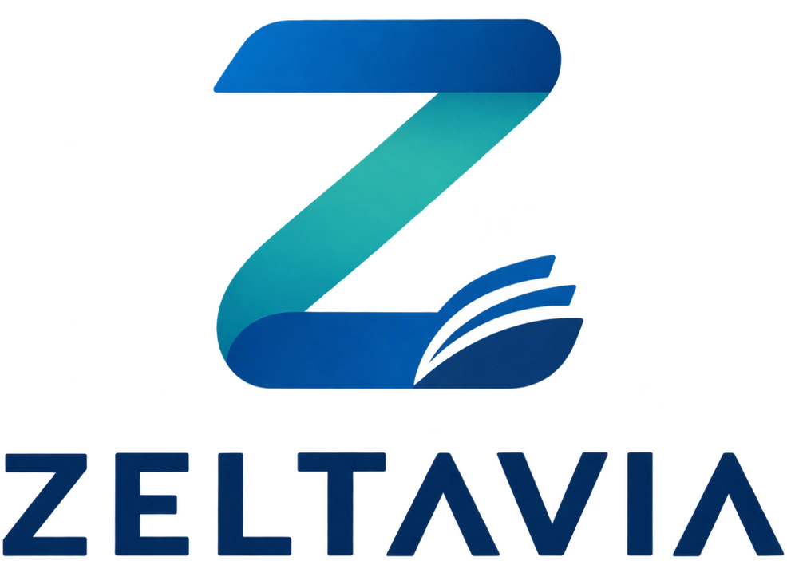

<div align="center">
  
</div>

# ZELTAVIA

> Interactive web application and pedagogical method for English acquisition based on lexical frequency bands, dual audiovisual coding, and synchronized speech synthesis. Created by Eduardo Garbayo.

## 🚀 Overview

**ZELTAVIA** is an advanced language-learning platform designed specifically for Spanish speakers. It combines modern web technologies with rigorous cognitive and pedagogical principles to optimize second-language acquisition, taking learners from foundational scaffolding to advanced nuances.

## ✨ Key Pedagogical Features

* **Lexical Frequency Mapping:** Aligned with Zipf's frequency bands to prioritize high-utility vocabulary and phrases.
* **Explicit Rules & "Noticing":** Structured micro-rules (*"Aha"* moments) and anti-translation filters tailored for Spanish speakers.
* **Controlled Lexical Coverage:** Graded narratives and reference stories ensuring optimal comprehension and gradual progression.
* **Dual Audiovisual Coding:** Integration of text, audio, and visual cues to enhance cognitive retention.
* **Spaced Repetition & Active Production:** Systematic review cycles and structured output exercises.

## 📚 The ZELTAVIA Word List

* **Spoken-First Frequency:** 5,000 lemmas in five 1,000-word bands, ranked by a single Zipf-based score combining movie/TV subtitle frequency with the NGSL.
* **Real-World Coverage:** Covers about 95% of subtitle tokens; the first 1,000 words alone cover 86%.
* **Everyday Language Included:** Interjections, colloquial forms (*gonna*, *wanna*) and tagged profanity, with each word's register marked.
* **Guaranteed Basics:** Days, months, numbers and colors are placed early by design.
* **Open & Reproducible:** Built only from open sources, with a single script and stable word IDs.
* **Multilingual by Design:** The list is language-independent; translations (Spanish today, French or Portuguese tomorrow) are separate files linked by ID.
  
## 🛠️ Technical Architecture

ZELTAVIA is built with a lightweight, efficient technology stack:

* **Frontend (JavaScript):** Interactive web reader featuring real-time synchronization using the **Web Speech API** (Text-to-Speech), dynamic text highlighting via `onboundary` events, speech speed control, and assisted translation tools.
* **Backend (PHP):** Server-side data handling and text retrieval services.

## 📂 Project Structure

```text
zeltavia/
│
├── css/
│   ├── styles.css
│   └── styles3.css
│
├── textos/                 # Frequency lists (0-5000 words) and Phase 1-6 stories
│   ├── Most Common English Words - ... .txt
│   └── Phase ... - Tale - ... .txt
│
├── traducciones/           # JSON translation files per phase
│   ├── de/                 # German translations
│   ├── es/                 # Spanish translations
│   └── fr/                 # French translations
│
├── idiomas/                # App interface languages
│   ├── cn.json, de.json, es.json, fr.json, pt.json
│   └── disponibles.json
│
├── js/
│   └── app.js              # Core client engine (Web Speech API, sync, translation UI)
│
├── get_texts.php           # Backend endpoint for text management
└── index.html              # Main application interface
